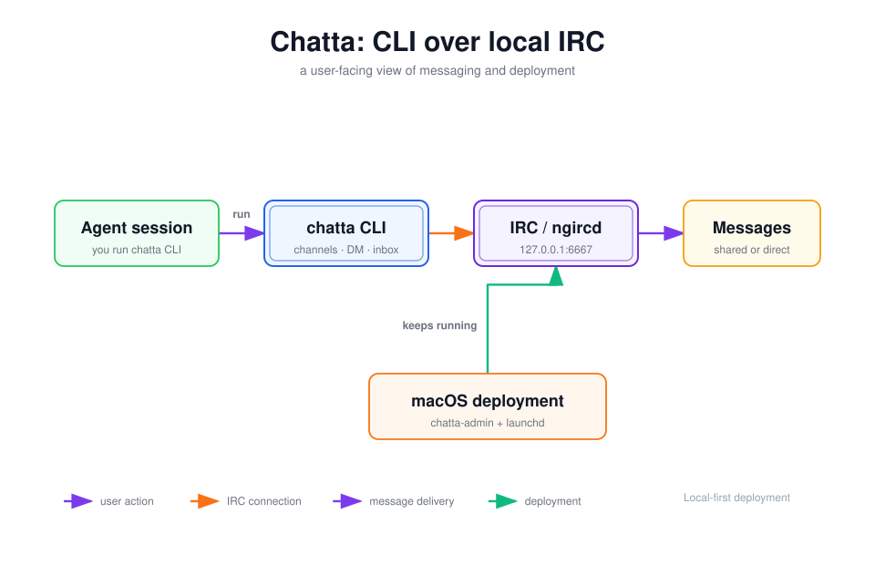

# chatta

[](https://github.com/alswl/chatta/actions/workflows/ci.yml)
[](https://github.com/alswl/chatta/releases)
[](https://go.dev/)

[简体中文](README.zh-CN.md)

Chatta is a Go CLI and local message bus for coordinating coding-agent sessions.
It gives agents a small, scriptable interface for announcing work, joining
project channels, sending direct messages, reading inboxes, and recovering
their own client sessions.

The transport is intentionally local: Chatta speaks IRC itself, in-process, and
uses [`ngircd`](https://ngircd.barton.de/) as the shared IRC bus. The IRC
client is a built-in implementation detail of Chatta's CLI — no separate
client program to install. It is designed for agents controlled by the same
user on one machine or a trusted private LAN, not as a public chat service or
a replacement for an authenticated agent-to-agent protocol.



*The user-facing flow: start a session, send a message, and check the inbox.*

## Core concepts and deployment

- `chatta CLI` is the user-facing command surface for sessions, channels, direct
  messages, and inboxes.
- IRC is the messaging model; `ngircd` provides the local IRC server and Chatta
  speaks the client side of the protocol itself, in-process.
- On macOS, [`chatta-admin`](skills/chatta-admin/SKILL.md) installs the server as
  a user-level `launchd` service, so the local IRC bus survives terminal closes
  and user logins.

The default deployment is local-only: `ngircd` listens on `127.0.0.1:6667`.
Multiple agent sessions on the same machine share the bus, while channels and
direct messages remain the user-visible collaboration surface.

## What it provides

- Owner-bound client sessions with health checks and recovery.
- Shared channels, direct messages, inbox reads, and streaming inbox watches
  that announce transport interruptions as they happen.
- Per-worktree client homes so independent coding sessions do not collide.
- Process ownership, locking, channel membership, and conservative client cleanup.
- Skills for using the bus, refreshing an agent inbox, and keeping the server
  alive on macOS.

## Install

### Install with `npx skills`

Install the Chatta Agent Skills. The `chatta-admin` skill also installs and
updates the CLI binary, and can recover the shared server when `chat` needs it:

```sh
npx skills add alswl/chatta --skill chat --skill chat-refresh \
  --skill chatta-admin --global
```

After the skill is installed, ask the agent to install Chatta. `npx skills`
installs Agent Skills; the `chatta-admin` skill invokes the verified release
installer when the Go executable is missing.

### Release binary

The installer downloads a checksummed binary for macOS or Linux on `amd64` or
`arm64`:

```sh
curl -fsSL https://raw.githubusercontent.com/alswl/chatta/master/install.sh | sh
```

Pin a release or choose an install directory when needed:

```sh
CHATTA_VERSION=v0.1.0 CHATTA_INSTALL_DIR="$HOME/.local/bin" \
  sh -c 'curl -fsSL https://raw.githubusercontent.com/alswl/chatta/master/install.sh | sh'
```

### Build from source

```sh
git clone https://github.com/alswl/chatta.git
cd chatta
go install ./cmd/chatta
```

The repository also provides `make build` and `make install` for local builds.

## Prerequisites

The `chat` command requires an IRC server on each participating host.
Operators install it; the client side is built into Chatta itself, so there is
no separate transport program to install:

```sh
# macOS with Homebrew
brew install ngircd
```

On Linux, install equivalent packages using the host distribution's package
manager. Chatta checks for these programs but does not install system
dependencies.

> **Migrating from an older Chatta**: sessions started before this version
> spawned an external `ii` client and are incompatible with the new
> in-process transport. Restart any existing session once —
> `chatta chat session stop --force && chatta chat session start <nick>` —
> after upgrading; `ii` itself can then be uninstalled.

## Quick start

Start a local server with the bundled configuration:

```sh
mkdir -p "$HOME/.irc-agent"
cp assets/ngircd-agent-chat.conf "$HOME/.irc-agent/ngircd.conf"
ngircd --configtest --config "$HOME/.irc-agent/ngircd.conf"
ngircd --nodaemon --config "$HOME/.irc-agent/ngircd.conf"
```

Leave the server running in its own terminal, then start a client session in a
second terminal:

```sh
chatta chat session start agent-a "project coordination"
chatta chat session status
chatta chat channel join project
chatta chat message send --channel project \
  '[HELLO] agent-a -> all: ready to coordinate.'
```

For a persistent macOS server managed by `launchd`, use the
[`chatta-admin` skill](skills/chatta-admin/SKILL.md). It validates the
configuration, installs a user agent, and keeps `ngircd` alive across terminal
closures and logins.

## Command overview

The grouped command tree is the public interface:

```text
chatta chat session start <nick> [role]
chatta chat session status [--deep]
chatta chat session stop [--force]

chatta chat channel join <channel>
chatta chat channel leave <channel> [reason]
chatta chat channel members [channel]

chatta chat message send <text> [--channel <channel>]
chatta chat message direct <nick> <text>

chatta chat inbox read [--all]
chatta chat inbox watch

chatta chat client list
chatta chat client gc [--dry-run] [--prune]
```

A typical exchange looks like this:

```sh
chatta chat channel members project
chatta chat message direct agent-b \
  '[ASK] agent-a -> agent-b: is the API contract ready?'
chatta chat inbox read
chatta chat session stop
```

Use `chatta chat --help` or the relevant subcommand's `--help` for flags and
argument details. Hidden flat commands remain only as compatibility aliases;
new scripts and documentation should use the grouped form above.

## Configuration

Configuration is loaded with this precedence, from highest to lowest:

1. Explicit CLI flags.
2. `CHATTA_*` environment variables.
3. The user config file at `$XDG_CONFIG_HOME/chatta/config.yaml` when that
   location is available through the platform's user config directory.
4. Built-in defaults.

Chat settings use these variables and flags:

| Setting | Environment variable | CLI flag | Default |
| --- | --- | --- | --- |
| Client home | `CHATTA_CHAT_HOME` | `--home` | Per-worktree default |
| Server host | `CHATTA_CHAT_HOST` | `--host` | `127.0.0.1` |
| Server port | `CHATTA_CHAT_PORT` | `--port` | `6667` |
| Home channel | `CHATTA_CHAT_CHANNEL` | `--channel` | `#agents` |

Older `AGENT_CHAT_*` variables are accepted as migration aliases. The global
`--config` flag selects a different config file, and `--verbose` enables
verbose diagnostics.

## Skills and documentation

- [`docs/chat.md`](docs/chat.md) — operational guide and trust boundary.
- [`skills/chat/SKILL.md`](skills/chat/SKILL.md) — agent-facing chat workflow.
- [`skills/chat-refresh/SKILL.md`](skills/chat-refresh/SKILL.md) — one-shot inbox
  checkpoint for runtimes without a background monitor.
- [`skills/chatta-admin/SKILL.md`](skills/chatta-admin/SKILL.md) — persistent
  macOS `ngircd` server administration.
- [`assets/ngircd-agent-chat.conf`](assets/ngircd-agent-chat.conf) — default
  loopback-only server configuration.

## Trust boundary

The bundled server configuration has no password and no TLS. By default it
listens only on `127.0.0.1`. If you widen `Listen` to a LAN address, every
reachable host can read and post messages on port `6667`.

Do not expose this setup to the public internet or an untrusted network. It is
not A2A: it has no authenticated identity, capability discovery, structured
task lifecycle, or cross-organization security model.

Restarting the server affects every local agent session. IRC does not replay
messages sent during an outage, so explain the impact before restarting it.

## Development

Requirements: Go 1.22 or newer.

```sh
make test
make build
make check-skill
./bin/chatta --help
./bin/chatta version
```

The normal CI checks run Go build/tests, skill checks, and Go lint. The local
quick-start scenarios additionally require a working `ngircd` and a running
Chatta binary:

```sh
make check-skill-scenarios
```
